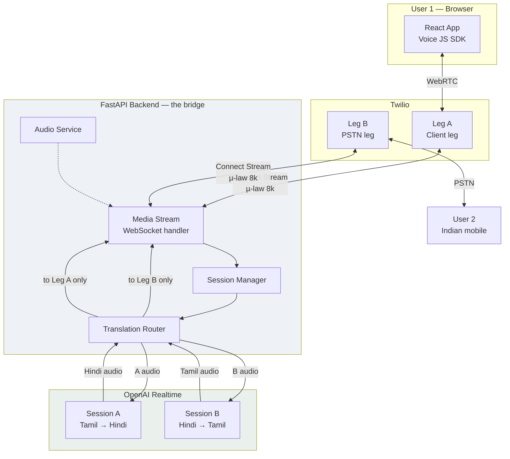
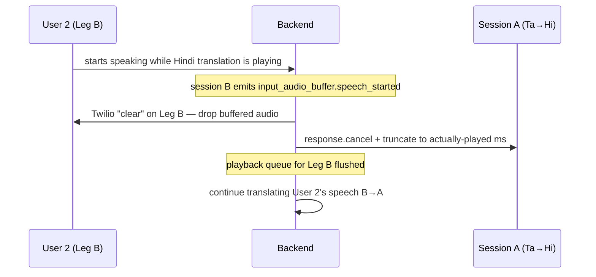

SLATION_DESIGN.md — ~5,800 words, all 25 required sections plus a sources list. This is Phase 1 (research + architecture); no implementation code yet, per the spec's own instruction to research and design first.
# Real-Time Voice Translation System

**Design & Architecture Document**

| | |
|---|---|
| **Status** | Phase 1 complete — research and architecture. Implementation not started. |
| **Version** | 1.0 |
| **Date** | 18 September 2026 |
| **Owner** | R&D Engineering |
| **Scope** | Browser (User 1) ⇄ PSTN mobile (User 2), continuous two-way speech translation |

> **How to read this document.** Statements are tagged so future developers can tell research from opinion:
> **[VERIFIED]** — confirmed against official documentation on 18 Sep 2026, source linked in §26.
> **[DECISION]** — an architectural choice we made, with reasoning.
> **[ASSUMPTION]** — believed true but not yet confirmed; must be validated before production.
> **[OPEN]** — unresolved, needs work.

---

## 1. Executive Summary

The system lets a person using a **web browser** and a person using an **ordinary mobile phone** hold a live conversation in two different languages. User 1 speaks Tamil; User 2 hears Hindi. User 2 replies in Hindi; User 1 hears Tamil. Neither party installs anything — User 2 answers a normal phone call.

The design uses **two independent Twilio call legs**, each connected to our backend over its own bidirectional Media Stream WebSocket. Twilio never bridges the two legs to each other. **Our FastAPI backend is the bridge**: it receives each participant's raw audio, runs it through a dedicated OpenAI Realtime speech-to-speech session configured as an interpreter, and plays the translated audio into the *opposite* leg only.

Two findings from the research phase materially shaped this design:

1. **A conference cannot do this.** Twilio's bidirectional Media Streams are the only way to push audio *into* a call, they are limited to one per call, and `<Connect><Stream>` takes the call out of normal TwiML flow — so a call cannot be in a conference and in a bidirectional stream at the same time. Audio injected into a conference is heard by everyone, which would make both parties hear both languages. **[VERIFIED]**
2. **No audio transcoding is needed.** Twilio Media Streams carry G.711 µ-law 8 kHz, and the OpenAI Realtime API accepts and emits `audio/pcmu` natively. Audio passes through byte-for-byte. **[VERIFIED]**

The dominant cost is not telephony. At current published rates the Twilio side is roughly **$0.062/min** while the OpenAI Realtime side is roughly **$0.085/min**, because a translated call requires **two** concurrent Realtime sessions. See §15.

---

## 2. Business / Technical Objective

This POC exists to answer four questions with real running code, not estimates:

1. **Is the media topology sound?** Can each participant's audio be captured independently and can translated audio be delivered to exactly one participant, with no cross-talk and no echo of the original language?
2. **Is the latency conversational?** Speech-to-speech translation inserts a full model round trip into the audio path. Does the result feel like a phone call or like a walkie-talkie?
3. **Does interruption work?** Real conversations overlap. When User 2 starts talking over a translation, does the stale audio stop?
4. **Can it legally and practically reach an Indian mobile?** Twilio's India rules are restrictive and must be proven in practice, not assumed.

Out of scope for the POC: multi-party calls, call recording, transcript persistence, billing, and production-grade scaling.

---

## 3. User Flow

**Setup (User 1, browser)**

1. Opens the React app, grants microphone permission.
2. Chooses *Your Language* = Tamil, *Translate To* = Hindi.
3. Enters User 2's mobile number in E.164 form (`+91XXXXXXXXXX`).
4. Presses **Start Translated Call**.

**Connection**

5. Frontend requests a Twilio Access Token, initialises the Voice SDK `Device`, and calls `device.connect()` with the session parameters. This creates **Leg A** (browser ⇄ Twilio).
6. Twilio fetches TwiML from our backend for Leg A; we return `<Connect><Stream>` pointing at our WebSocket. Leg A's audio now flows to us.
7. The backend originates **Leg B** via the REST API to User 2's mobile. When User 2 answers, Twilio fetches TwiML for Leg B; we return a second `<Connect><Stream>`.
8. Both streams register against the same session. Status becomes `CONNECTED`, then `TRANSLATING`.

**Conversation**

```
User 1 speaks Tamil → Leg A stream → backend → OpenAI session A (Tamil→Hindi)
                    → Hindi audio → Leg B stream → User 2 hears Hindi

User 2 speaks Hindi → Leg B stream → backend → OpenAI session B (Hindi→Tamil)
                    → Tamil audio → Leg A stream → User 1 hears Tamil
```

**Teardown**

9. Either party hangs up. Twilio fires a status callback; the backend hangs up the peer leg via REST, closes both OpenAI sessions, and destroys the session object.

---

## 4. Architecture



The critical property: **the two Twilio legs are never bridged to each other.** There is no Twilio-internal audio path between User 1 and User 2. Every sample travels through our backend. This is what makes per-participant translation possible, and it is also the design's biggest liability (§12, §18).

---

## 5. Twilio Architecture

### 5.1 Why two legs and not a conference

We evaluated three topologies against the requirement *"translated audio must reach only the opposite participant."*

| Option | Mechanism | Verdict |
|---|---|---|
| **A. Two independent legs, backend bridges** | Each leg runs `<Connect><Stream>`; backend routes audio between them | **Selected** |
| **B. Conference + per-participant streams** | Participants in a `<Dial><Conference>`, `<Start><Stream>` forks each participant's audio | **Rejected** |
| **C. Conference + coach/whisper legs** | Both participants muted, two extra "coach" legs whisper translations | **Rejected** |

**Why B fails.** `<Start><Stream>` is unidirectional — it forks audio *out* of the call and provides no way to send audio back. **[VERIFIED]** The only way to push audio into a call is `<Connect><Stream>`, which is bidirectional but **blocks subsequent TwiML** — the call is connected *to the WebSocket*, so it cannot simultaneously be connected to a conference. **[VERIFIED]** The remaining option, injecting audio into the conference itself, broadcasts to every participant, so User 1 would hear the Hindi translation intended for User 2. Option B cannot satisfy the routing requirement.

**Why C fails on cost and complexity, not capability.** Conference coaching lets one participant's audio be heard by a single target participant, which in principle allows whispering a translation. But it requires four call legs instead of two, both real participants muted from the conference (making the conference itself pointless), and two extra `<Connect><Stream>` legs to inject the coach audio. It roughly doubles telephony cost and adds failure modes for no functional gain over Option A. **[DECISION]**

**Why A works.** Each leg independently gives us its inbound audio and accepts audio we send back. The backend knows which stream a `media` message arrived on, so it always knows who spoke; it plays the translation into the other stream. Isolation is structural, not conventional — there is no shared audio bus that could leak.

### 5.2 Relevant Media Streams constraints **[VERIFIED]**

- Bidirectional streams: **one per call**. Unidirectional: up to four forked tracks per call.
- Bidirectional streams expose **only `inbound_track`** — the audio the far end sent. That is exactly what we need; we do not want to hear our own injected audio back.
- Each stream needs its own dedicated WebSocket connection.
- `X-Twilio-Signature` must be validated on webhooks.
- DTMF arrives inbound only on bidirectional streams; outbound DTMF is unsupported.

### 5.3 Leg A — browser

The Voice JS SDK (`@twilio/voice-sdk`) does not dial a destination directly. `device.connect()` causes Twilio to fetch TwiML from the **TwiML App's VoiceUrl**, which points at our backend. **[VERIFIED]** We return:

```xml
<Response>
  <Connect>
    <Stream url="wss://BACKEND/ws/media-stream">
      <Parameter name="session_id" value="SESSION_ID"/>
      <Parameter name="participant" value="A"/>
    </Stream>
  </Connect>
</Response>
```

Custom `<Parameter>` values arrive in the stream's `start` message as `customParameters`, which is how a WebSocket connection identifies itself. Leg A is billed as a client leg. **[VERIFIED]**

### 5.4 Leg B — PSTN

Originated server-side with the REST API (`calls.create`), `from` = a **non-Indian** Twilio number (§14), `to` = User 2. Twilio then fetches TwiML for Leg B from our backend, and we return an identical `<Connect><Stream>` with `participant=B`.

### 5.5 Identifier binding

| Identifier | Source | Purpose |
|---|---|---|
| `session_id` | Generated by us before Leg A starts | Primary key for the whole conversation |
| `call_sid` (A, B) | Twilio, at leg creation / status callback | Hang up the peer leg; correlate status events |
| `stream_sid` (A, B) | Twilio `start` message | Required in every outbound `media`/`clear`/`mark` message |
| `participant` | Our `<Parameter>` | Tells the WebSocket handler which side it is |
| OpenAI session id (A, B) | OpenAI on connect | Correlate model events to a direction |

Binding order matters: the `session_id` is minted **before** any Twilio call exists, passed through TwiML parameters, and echoed back in `start`. No lookup by phone number or timing is ever needed, which is what prevents concurrent calls from cross-wiring.

---

## 6. OpenAI Architecture

**[VERIFIED]** The Realtime API is GA. The current model family is `gpt-realtime-2.1` (with `gpt-realtime-2.1-mini`). The GA session shape uses `session.type`, `session.audio.input`, `session.audio.output` and `output_modalities`; the old flat `input_audio_format` / `output_audio_format` fields and the `OpenAI-Beta: realtime=v1` header belong to the beta and must not be used.

**[DECISION] Transport: server-side WebSocket**, not WebRTC. Our audio originates from Twilio on the server, not from a browser, so there is nothing for WebRTC to do; WebSocket keeps all keys server-side.

**[DECISION] Two sessions per call, one per direction.** Session A is configured *Tamil in, Hindi out* and is fed only Leg A audio; Session B is the mirror. One session cannot serve both directions: it would have no way to know which language it is hearing, and its output would have a single destination. Two sessions also mean the two directions can be active simultaneously, which is what makes overlapping speech possible.

**[DECISION] Audio format `audio/pcmu`** on both input and output, matching Twilio's G.711 µ-law 8 kHz exactly. **[VERIFIED]** This removes the entire resampling stage from the hot path. A PCM-16/24 kHz fallback with resampling is specified in §7 in case a future model drops `pcmu`.

**Turn detection.** **[VERIFIED]** `session.audio.input.turn_detection` supports `server_vad` (silence-based; parameters `threshold`, `prefix_padding_ms`, `silence_duration_ms`) and `semantic_vad` (a classifier that judges whether the utterance is semantically complete; parameter `eagerness`). Both support `create_response` and `interrupt_response` in speech-to-speech mode, and both emit `input_audio_buffer.speech_started` / `speech_stopped`.

**[DECISION]** Start with `server_vad`, `silence_duration_ms` tuned low (~300–500 ms) to minimise the wait before translation begins. `semantic_vad` is the better fit for turn-taking quality but waits for semantic completion, which adds latency — it is a Phase 11 experiment, not the default. **[OPEN]** Measure both.

**Interpreter instructions.** The session prompt must suppress the model's default assistant behaviour:

```
You are a simultaneous interpreter. You will hear speech in {SOURCE}.
Render it in natural, spoken {TARGET}.

Never answer, greet, comment on, summarise, explain or add to what
you hear. You are not a participant in the conversation.
Preserve meaning, register, tone and conversational intent.
Speak only {TARGET}. If the audio is unintelligible, say nothing.
```

**[OPEN] Known risk:** the Realtime API is built as a conversational agent. Instruction-following for pure interpretation is good but not guaranteed — the model can occasionally respond rather than translate. Mitigations: strict instructions, low temperature, and logging output transcripts during testing so the failure rate is measured rather than assumed. If it proves unacceptable, the fallback is an explicit streaming STT → translation → streaming TTS chain, at a latency cost.

---

## 7. Audio Pipeline

**Primary path (no transcoding):**

```
Twilio media message
  → base64 decode
  → G.711 µ-law 8 kHz bytes
  → OpenAI input_audio_buffer.append  (format audio/pcmu)
  → model
  → response.output_audio.delta       (format audio/pcmu)
  → base64 encode
  → Twilio media message on the OPPOSITE stream
```

**Fallback path**, only if `pcmu` is unavailable for the chosen model: µ-law → PCM16 → resample 8 k→24 k → model → 24 k→8 k → PCM16 → µ-law. This adds conversion cost and quality loss and must be benchmarked before adoption. **[ASSUMPTION]** The fallback is not expected to be needed.

All conversion lives in `app/utils/audio.py` behind `ulaw_to_pcm16()` / `pcm16_to_ulaw()` / `resample()`. No audio maths anywhere else in the codebase.

**Buffering.** Twilio delivers ~20 ms frames. Outbound audio from the model is written to a per-leg playback queue rather than straight to the socket, because the queue is what makes barge-in possible (§8) — you cannot un-send bytes already written. Each queue tracks how many milliseconds have actually been played, using `mark` acknowledgements.

---

## 8. Bidirectional Translation and Barge-In

### 8.1 The routing rule

One rule governs everything, and it is enforced in a single function so it cannot be violated by accident:

> Audio received on leg *X* is fed to the session that translates *X*'s language, and that session's output is written **only** to the peer leg of *X*.

There is no code path that writes a session's output back to its own source leg.

### 8.2 Interruption

The subtle part: a participant interrupting is detected on *their* session, but the audio to stop belongs to the *other* session.



**[VERIFIED]** Twilio supports `clear` (discard all buffered outbound audio) and `mark` (echoed back when playback of preceding audio completes). `mark` is what tells us how much of the translation the listener actually heard, so we can truncate the model's conversation item to match — otherwise the model believes it said more than was heard.

The symmetric case (User 1 interrupting) is identical with A and B swapped.

**[OPEN]** Because the two legs are never bridged, a participant speaking hears *silence* from the other side until the translation arrives. Real interpreted calls have this property too, but it should be measured for acceptability. Optional future enhancement: mix a heavily attenuated copy of the original speaker's audio into the peer leg so the listener can hear that someone is talking.

---

## 9. Session State

```
TranslationSession
  session_id            str, generated server-side
  status                CONNECTING | CONNECTED | TRANSLATING | ENDING | ENDED | ERROR
  created_at            datetime
  participant_a         Participant(type=browser, language=ta, call_sid, stream_sid,
                                    ws, playback_queue, openai_session)
  participant_b         Participant(type=pstn,   language=hi, call_sid, stream_sid,
                                    ws, playback_queue, openai_session)
  translation           A→B: ta→hi   B→A: hi→ta
  metrics               latency samples, packet counters
```

Sessions live in an in-process registry keyed by `session_id` for the POC. **[DECISION]** Deliberately not Redis yet — a single process cannot be horizontally scaled anyway while it holds live WebSockets (§17). Isolation is guaranteed because every audio write is addressed by `stream_sid` taken from the session object, never from ambient state.

---

## 10. API Contract

| Method | Path | Purpose |
|---|---|---|
| `GET` | `/health` | Liveness; reports Twilio/OpenAI reachability |
| `POST` | `/api/call/token` | Issue a Twilio Access Token with a VoiceGrant for the browser |
| `POST` | `/api/call/start` | Create session, originate Leg B, return `session_id` |
| `POST` | `/api/call/twiml/{participant}` | TwiML webhook returning `<Connect><Stream>` |
| `POST` | `/api/call/status` | Twilio status callback for both legs |
| `POST` | `/api/call/end` | Hang up both legs, tear down sessions |
| `GET` | `/api/call/{session_id}` | Session status for UI polling/diagnostics |
| `WS` | `/ws/media-stream` | Twilio Media Streams endpoint (both legs) |

**`POST /api/call/start`**

```jsonc
// request
{ "phone_number": "+91XXXXXXXXXX", "source_language": "ta", "target_language": "hi" }
// 201
{ "session_id": "sess_...", "status": "CONNECTING" }
// errors
// 400 INVALID_PHONE_NUMBER | INVALID_LANGUAGE   422 UNSUPPORTED_DESTINATION
// 502 TWILIO_ERROR                              503 OPENAI_UNAVAILABLE
```

Every error response is `{ "error": { "code": "...", "message": "..." } }` with a safe human-readable message. Stack traces and provider payloads are logged, never returned.

---

## 11. WebSocket Protocol

**Twilio → backend** **[VERIFIED]**

| Message | Handling |
|---|---|
| `connected` | Protocol ack; no action |
| `start` | Read `streamSid` + `customParameters`; bind to session and participant; open the OpenAI session for that direction |
| `media` | base64 µ-law payload → `input_audio_buffer.append` on that participant's session |
| `dtmf` | Logged; no behaviour in the POC |
| `mark` | Playback of a queued chunk completed → advance the played-ms counter |
| `stop` | Stream ended → tear down that direction |

**Backend → Twilio** **[VERIFIED]**: `media` (base64 µ-law, addressed with the peer's `streamSid`), `mark` (sent after each chunk to track playback), `clear` (flush on barge-in).

**Backend → OpenAI**: `session.update` (formats, VAD, interpreter instructions, voice), `input_audio_buffer.append`, `response.cancel`, `conversation.item.truncate`.

**OpenAI → backend**: `session.created`/`updated`, `input_audio_buffer.speech_started` / `speech_stopped`, `response.output_audio.delta` (the audio we forward), `response.output_audio_transcript.delta` (logged for QA), `response.done`, `error`.

---

## 12. Error Handling

| Failure | Detection | Response to user |
|---|---|---|
| Microphone denied | Browser permission API | Explain and offer retry; no call created |
| Token request fails | HTTP error from `/api/call/token` | "Could not start the call" + retry |
| Invalid number | Server-side E.164 + region validation | Inline field error before any cost is incurred |
| User 2 rejects / busy / no answer | Twilio status callback | Explicit state on the call screen; hang up Leg A |
| PSTN unreachable (India rules) | Twilio error code on `calls.create` | Specific message — this is an expected failure in India (§14) |
| Twilio stream drops | WebSocket close on one leg | Mark that direction degraded; end call if it does not recover |
| OpenAI disconnects | WebSocket close / `error` event | Reconnect that direction with backoff; other direction keeps working |
| Translation stalls | No `response.output_audio.delta` within timeout | Log, cancel response, resume on next utterance |
| Browser network loss | SDK reconnect events | `RECONNECTING` state; end after timeout |
| Either party hangs up | Status callback | Hang up peer leg, close both AI sessions, destroy session |

**Principle:** a failure in one direction must not kill the other. The two pipelines are independent by construction and must be supervised independently.

---

## 13. Security

- All secrets in environment variables; `.env` git-ignored; `.env.example` documents every variable. No key ever reaches the browser — the frontend receives only a short-lived Access Token.
- `X-Twilio-Signature` validated on every Twilio webhook **[VERIFIED requirement]**.
- The Media Stream WebSocket authenticates by `session_id` passed through TwiML `<Parameter>`; unknown or already-bound session ids are rejected. Session ids are unguessable random tokens.
- Phone numbers validated to E.164 and checked against an allowed-destination list in the POC, so a stray request cannot dial arbitrary international numbers.
- Language codes validated against an allowlist before entering a model prompt.
- CORS restricted to the configured frontend origin. Production requires HTTPS and WSS throughout; Twilio will not connect to an insecure WebSocket.
- Logs never contain API keys, tokens, raw audio, or full phone numbers — numbers are masked as `+91******1234`.
- No call audio is written to disk in the POC.

---

## 14. India / PSTN Limitations

**[VERIFIED]** from Twilio's India Voice Guidelines — these are hard constraints, not cautions:

| Rule | Consequence for this POC |
|---|---|
| Outbound calls to India can only be made **from international (non-Indian) numbers** | Leg B must originate from a non-Indian Twilio number |
| **Domestic India-to-India calling is not supported** | An Indian Twilio number cannot be used to call an Indian mobile |
| **Inbound calling to Indian Twilio numbers is not available** | User 2 cannot dial in; the system must always dial out |
| Caller ID must be **+E.164** | Enforced server-side |
| High volumes of short-duration calls may trigger **automated carrier blocks** | Test deliberately, not in bursts |
| Consent required; unsolicited commercial calls fall under TRAI/UCC enforcement | The POC dials only consenting internal testers |

**[OPEN]** These must be re-checked against the live guidelines and our account's entitlements before any demo to stakeholders — account-level permissions (geographic permissions) also have to be enabled for India. Twilio states these guidelines are not legal advice; a production rollout needs a compliance review.

**Consequence:** the PSTN path may be blocked or unreliable for reasons entirely outside our code. This is exactly why Demo Mode exists.

---

## 15. Cost Analysis

Per connected minute, both legs live. Twilio prices **[VERIFIED]** 18 Sep 2026; OpenAI prices **[VERIFIED]** 18 Sep 2026.

| Component | Rate | Per call-minute |
|---|---:|---:|
| Leg A — browser/client leg | $0.0040/min | $0.0040 |
| Leg B — outbound to Indian mobile | $0.0496/min | $0.0496 |
| Media Streams × 2 legs | $0.004/min each | $0.0080 |
| **Twilio subtotal** | | **$0.0616** |
| OpenAI audio input — 2 sessions listening | $32/1M audio tokens | $0.0384 |
| OpenAI audio output — translations spoken | $64/1M audio tokens | ~$0.046 |
| **OpenAI subtotal** | | **~$0.085** |
| **Total** | | **~$0.15/min ≈ ₹14/min** |

Notes and honesty about this table:

- **Two Realtime sessions run per call**, both listening continuously, so input audio is billed at 2× wall-clock time. This is the single biggest cost driver and it is inherent to the topology.
- Output cost assumes roughly 60% of the call is speech being translated. Real ratio must be measured. **[ASSUMPTION]**
- The token conversion (≈600 input tokens and ≈1,200 output tokens per minute of audio) comes from **secondary sources**, not the official pricing page. **[OPEN]** Confirm from billing telemetry during Phase 11.
- **Discrepancy noted:** an earlier internal cost sheet used **$0.0044/min** for Media Streams; Twilio's published figure is **$0.004/min**. The published figure is used here. The earlier sheet also omitted the browser leg, the second Media Stream, and all OpenAI cost — it estimated ₹5.18/min against roughly **₹14/min** here.
- `gpt-realtime-2.1-mini` is ~3× cheaper ($10/$20 per 1M) and would bring the total to roughly $0.09/min. **[OPEN]** Evaluate whether mini's interpretation quality is acceptable.
- Excluded: backend hosting, egress, phone number rental (~$1.15/mo for an international number), and taxes.

---

## 16. Latency

Budget per translated utterance, end of speech to start of translated audio:

| Stage | Expected |
|---|---|
| Twilio → backend (media frame) | 20–60 ms |
| VAD end-of-speech decision | 300–500 ms (`silence_duration_ms`, tunable) |
| Model first audio token | 300–800 ms **[ASSUMPTION]** |
| Backend → Twilio → listener | 50–150 ms |
| **Total to first translated audio** | **~0.7–1.5 s** |

The VAD silence window and the model's first-token time dominate. Nothing in the audio conversion path matters, because there is no conversion.

Instrumentation is mandatory, not optional — every session records timestamps for: speech_started, speech_stopped, first byte appended, first `output_audio.delta`, first byte written to the peer leg, and first `mark` acknowledgement. These are logged per utterance with the session id so a slow call can be diagnosed after the fact.

**[OPEN]** Whether ~1 s feels conversational is the POC's central UX question and can only be answered by listening.

---

## 17. Scalability

Honest assessment. Per active call the backend holds **2 Twilio WebSockets + 2 OpenAI WebSockets** and does continuous small-frame I/O.

| Scale | Assessment |
|---|---|
| 1 call | Single process, local tunnel. Works today. |
| 10 calls | Single process. 40 sockets; comfortable for async Python if no blocking work touches the event loop. |
| 100 calls | 400 sockets. Needs multiple workers and **sticky routing** — both legs of a call must land on the same process, because sessions are in-process. Requires a session registry and a routing layer. Not designed yet. **[OPEN]** |
| 1000 calls | Requires a different architecture: externalised session state, horizontal media workers, connection-aware load balancing, plus OpenAI concurrency limits and Twilio account limits confirmed in writing. **No claim is made that the current design reaches this.** |

The POC targets 1–10 concurrent calls. Anything beyond that is a separate design exercise.

---

## 18. Failure Scenarios

| Failure | Detection | Recovery |
|---|---|---|
| Twilio stream disconnect (one leg) | WebSocket close, no `stop` | Mark direction degraded; end call if not restored within timeout; peer leg hung up cleanly |
| Twilio call drops | Status callback `completed`/`failed` | Hang up peer leg, close both AI sessions, session → `ENDED` |
| OpenAI disconnect | Socket close or `error` event | Reconnect with backoff, re-send `session.update`; other direction unaffected |
| OpenAI rate limit / quota | `error` event with code | Surface a clear message; end call rather than play silence |
| PSTN failure (India rules, carrier block) | Twilio error on `calls.create` or status `failed` | Specific user-facing message; Leg A torn down; logged as a compliance event |
| Backend crash | Both legs drop | Calls end; no state to recover in the POC. Twilio status callbacks reconcile billing |
| Browser network loss | SDK `reconnecting`/`offline` events | `RECONNECTING` state; hang up after timeout |
| Model answers instead of translating | Output transcript monitoring | Logged and counted; prompt iteration (§6) |
| Stale audio after interruption | `mark`/`clear` accounting | Covered by §8; regression-tested |

---

## 19. Security & Privacy Considerations

Call audio for **both** participants leaves Twilio, transits our backend, and is sent to OpenAI. That is a meaningful privacy posture and must be stated plainly to anyone whose call is translated.

- **Processing, not storage.** Audio is held in memory only for the duration of a frame. Nothing is persisted in the POC.
- **Third-party processing.** Both parties' speech is processed by OpenAI. Data-handling terms, retention and regional processing must be reviewed before any non-internal use. **[OPEN]**
- **Consent.** User 2 receives a call and their speech is machine-processed. For anything beyond internal testing, an explicit disclosure at call start is required, and Indian telecom consent rules (§14) apply.
- **Metadata.** Session ids, call SIDs, timings and latencies are logged; phone numbers are masked; transcripts are logged only in development and must be off by default.
- **Keys.** Server-side only, rotated, never logged, never in git history.

---

## 20. Technology Decisions

| Component | Technology | Reason |
|---|---|---|
| Frontend | React + Twilio Voice JS SDK | The SDK is the supported way to put a browser on a Twilio call leg; React gives us the state machine and component system for the call UI |
| Telephony | Twilio Programmable Voice | Provides carrier connectivity, a browser client leg, and bidirectional Media Streams in one platform. Self-hosted alternatives provide none of the PSTN reach (§21) |
| Backend | FastAPI (async Python) | Native async WebSocket handling for four sockets per call; same language as the audio/ML ecosystem |
| Translation | OpenAI Realtime, `gpt-realtime-2.1` | Speech-to-speech in one hop — avoids the STT→MT→TTS latency stack; accepts `audio/pcmu` natively |
| Transport (Twilio) | Bidirectional Media Streams over WSS | The only Twilio mechanism that both receives and injects call audio |
| Transport (OpenAI) | Server-side WebSocket | Audio originates server-side; keeps credentials off the client |
| Media bridging | Our backend | Required — no Twilio topology routes translated audio to a single participant (§5.1) |

---

## 21. Alternatives Considered

**Asterisk / FreeSWITCH / Fonoster instead of Twilio.** These are capable programmable telephony platforms and could serve as the media layer — Asterisk via ARI/AudioSocket, Fonoster via its streaming APIs. What they do not provide is PSTN reach: a SIP trunk and telephone numbers still have to be bought from a carrier or SIP provider, and India's restrictions would apply to that provider too. The trade is real, not one-sided: self-hosting removes per-minute platform fees and gives full media control (including the ability to mix ducked original audio easily), at the cost of operating SIP infrastructure, NAT/media traversal, redundancy and compliance ourselves, and writing the browser client leg that the Twilio SDK gives us for free. For a POC whose purpose is to test translation quality and latency, that is the wrong place to spend effort. **[DECISION]** Revisit if per-minute cost at volume justifies it.

**OpenAI Realtime SIP connector.** **[VERIFIED]** OpenAI now accepts SIP calls directly: a provider's trunk points at `sip:{project-id}@sip.api.openai.com;transport=tls`, a `realtime.call.incoming` webhook fires, and the call is accepted over a control WebSocket. Twilio publishes an Elastic SIP Trunking tutorial for exactly this. It is genuinely simpler — for a **single-party voice agent**. It does not fit our case: it makes OpenAI the call endpoint, whereas we need a bridge that takes audio from one party and plays it to a *different* party. We would still need our own media path between the two calls, which is what we are building anyway. **[DECISION]** Rejected for this topology; strong candidate if the product ever becomes "call an AI agent".

**Explicit STT → MT → TTS chain.** More control, per-stage observability, cheaper components, and easier language coverage. But three sequential network hops add latency, and prosody and speaker intent are lost at the text boundary. Held as the fallback if speech-to-speech interpretation proves unreliable (§6).

**Twilio Conference topologies.** Analysed and rejected in §5.1.

---

## 22. Known Limitations

Stated plainly:

1. **No native audio path between participants.** If our backend dies, the call is dead — Twilio is not bridging the legs.
2. **Neither party hears the other's actual voice**, only a synthesised translation. Tone and identity are lost; simultaneous speech is not conveyed.
3. **~1 s of added latency per utterance** is inherent. This is interpretation, not telepathy.
4. **The model may occasionally respond instead of translating.** Mitigated by prompt, not eliminated.
5. **India PSTN is a hard external dependency** with documented restrictions that can block the flow regardless of code quality (§14).
6. **Cost is ~₹14/min**, roughly 3× a Twilio-only estimate, driven by two concurrent Realtime sessions.
7. **Single-process, in-memory sessions.** Not horizontally scalable as designed (§17).
8. **Two languages tested.** Tamil↔Hindi quality on telephone-grade 8 kHz audio is unmeasured. **[OPEN]**
9. **8 kHz µ-law is a narrowband, lossy input** to the model. Recognition quality on accented or noisy telephone audio is unknown.

---

## 23. Future Improvements

- Mix a ducked copy of the original speaker's audio so listeners perceive natural turn-taking.
- Evaluate `gpt-realtime-2.1-mini` for a ~40% total cost reduction.
- `semantic_vad` evaluation for more natural turn boundaries.
- Externalised session state + sticky routing for horizontal scale.
- Live transcript panel in the UI (both languages) — useful for QA, and a real product feature.
- Speaker identification, additional language pairs, quality telemetry.
- Consent announcement played to User 2 at call start.
- SIP provider / self-hosted telephony evaluation if volume justifies it.
- Call recording **only** where legally permitted and explicitly consented.

---

## 24. R&D Findings

Findings from the Phase 1 research that changed the design:

1. **Conferences cannot route per-participant audio.** `<Start><Stream>` cannot inject; `<Connect><Stream>` cannot coexist with a conference; conference audio is broadcast. This eliminated the topology most people reach for first. **[VERIFIED]**
2. **Bidirectional streams are limited to one per call and expose only `inbound_track`.** Both limits are compatible with our design — and both would have broken a single-call design. **[VERIFIED]**
3. **`audio/pcmu` end-to-end removes transcoding entirely.** Twilio's µ-law 8 kHz feeds the model directly. **[VERIFIED]**
4. **The Realtime API's GA session shape differs from the beta.** Nested `session.audio.input/output.format` objects; the `OpenAI-Beta` header is gone. Most public tutorials still show the beta shape — following them would produce type errors. **[VERIFIED]** This is the clearest case of sources disagreeing: community examples and older blog posts are outdated, the official GA reference wins.
5. **OpenAI now accepts SIP directly**, which reshapes the alternatives analysis but does not fit a two-party translation bridge. **[VERIFIED]**
6. **Cost is dominated by OpenAI, not Twilio** — 2 sessions/call, ~$0.085/min versus ~$0.062/min. Earlier internal estimates understated total cost by roughly 3×.
7. **Trial accounts: the documented restriction is narrower than it reads.**
   Twilio's trial docs list "streaming" among blocked features, which suggested
   the whole system needed an upgraded account. **Testing on 18 Sep 2026
   contradicted that**: on a trial account the browser leg ran
   `<Connect><Stream>` successfully and full speech-to-speech translation
   worked end to end. What trial *does* block is outbound PSTN to **unverified
   numbers** (error 21219) and some `calls.create` parameters. Practical rule:
   **the browser-only pipeline is fully testable on trial; dialling a real
   phone needs the destination verified, or an upgrade.** **[VERIFIED by test]**
8. **India remains the largest external risk.** Outbound-only, from a non-Indian number, with carrier-block exposure. **[VERIFIED]**

---

## 25. Implementation Status

```
[x] Phase 1  Research + architecture (this document)
[ ] Phase 2  Backend foundation (config, health, session manager, logging)
[ ] Phase 3  React premium UI + design system
[ ] Phase 4  Twilio Access Token + Voice SDK device
[ ] Phase 5  Browser → PSTN call (no translation)
[ ] Phase 6  Media Streams on both legs, audio arriving and identified
[ ] Phase 7  OpenAI Realtime session wiring
[ ] Phase 8  User 1 → User 2 translation
[ ] Phase 9  User 2 → User 1 translation
[ ] Phase 10 Barge-in (mark / clear / truncate)
[ ] Phase 11 End-to-end testing + latency measurement
[ ] Phase 12 Security review, cleanup, final documentation
```

Component checklist:

```
[ ] Architecture implemented   [ ] React UI          [ ] Twilio token
[ ] Twilio call (Leg A)        [ ] PSTN call (Leg B) [ ] Media Stream handler
[ ] OpenAI realtime session    [ ] Translation A→B   [ ] Translation B→A
[ ] Barge-in                   [ ] Error handling    [ ] Tests
[ ] Demo mode (browser↔browser)[ ] End-to-end test
```

---

## 26. Sources

Checked 18 September 2026.

- Twilio — TwiML `<Stream>`: https://www.twilio.com/docs/voice/twiml/stream
- Twilio — Media Streams overview and limits: https://www.twilio.com/docs/voice/media-streams
- Twilio — Media Streams WebSocket messages: https://www.twilio.com/docs/voice/media-streams/websocket-messages
- Twilio — Bidirectional streaming changelog: https://www.twilio.com/en-us/changelog/bi-directional-streaming-support-with-media-streams
- Twilio — Voice JavaScript SDK: https://www.twilio.com/docs/voice/sdks/javascript
- Twilio — TwiML `<Conference>`: https://www.twilio.com/docs/voice/twiml/conference
- Twilio — India Voice Guidelines: https://www.twilio.com/en-us/guidelines/in/voice
- Twilio — India Voice pricing: https://www.twilio.com/en-us/voice/pricing/in
- Twilio — US Voice pricing (client/SIP leg rates): https://www.twilio.com/en-us/voice/pricing/us
- Twilio — OpenAI Realtime + Elastic SIP Trunking: https://www.twilio.com/en-us/blog/developers/tutorials/product/openai-realtime-api-elastic-sip-trunking
- Twilio — AI voice assistant with Realtime API (Python): https://www.twilio.com/en-us/blog/voice-ai-assistant-openai-realtime-api-python
- OpenAI — Realtime guide: https://developers.openai.com/api/docs/guides/realtime
- OpenAI — Realtime VAD: https://developers.openai.com/api/docs/guides/realtime-vad
- OpenAI — Realtime conversations: https://developers.openai.com/api/docs/guides/realtime-conversations
- OpenAI — Realtime client events reference: https://developers.openai.com/api/reference/resources/realtime/client-events
- OpenAI — Pricing: https://developers.openai.com/api/docs/pricing

**Document control.** Update this document whenever an architectural decision changes. Tags (`[VERIFIED]`, `[DECISION]`, `[ASSUMPTION]`, `[OPEN]`) must be kept accurate — an `[ASSUMPTION]` that has been tested becomes `[VERIFIED]` with a date, and a broken `[VERIFIED]` becomes `[OPEN]` with an explanation.
